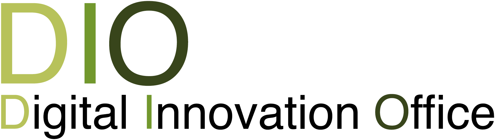

<section markdown="0" class="featured-image" style="background-image: url(assets/images/1900x1200_img_7.jpg)">

</section>
    
<section id="intro">
  

    

      

        

## Who are we

The Digital Innovation Office (DIO) fosters and manages collaborations on Digital Technology between the [University of Southern Denmark (SDU)](https://www.sdu.dk/en/), companies, and other organisations. Collaborations are both at national and international level.
DIO provides the necessary technical, scientific, and pedagogical know-how to carry out these activities. DIO is an inclusive unit: it covers different degrees and topics related to Digital Technology and it operates in close collaboration with the [Research and Innovation Office](https://www.sdu.dk/en/forskning/forskerstoette) at SDU, which provides legal and administrative support.

</section>